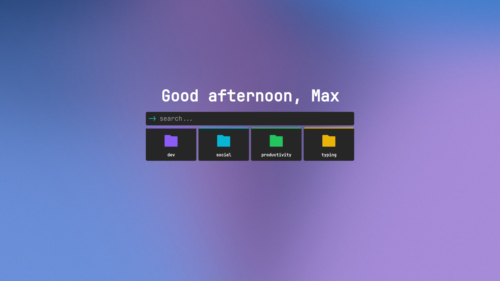

# mtab-config-public

my mtab config

## setup

copy contents from `config/config.txt` and paste it after pressing the import button in the mtab options page

and download the wallpaper from `config/wallpaper.gif` and choose that after clicking `wallpaper.fileUpload > choose file` in the mtab options page

## showcase

